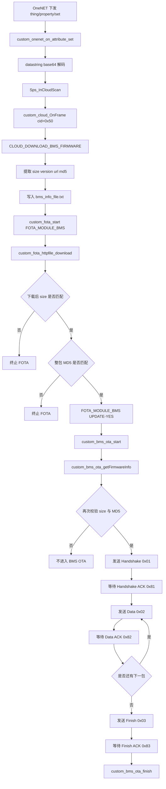
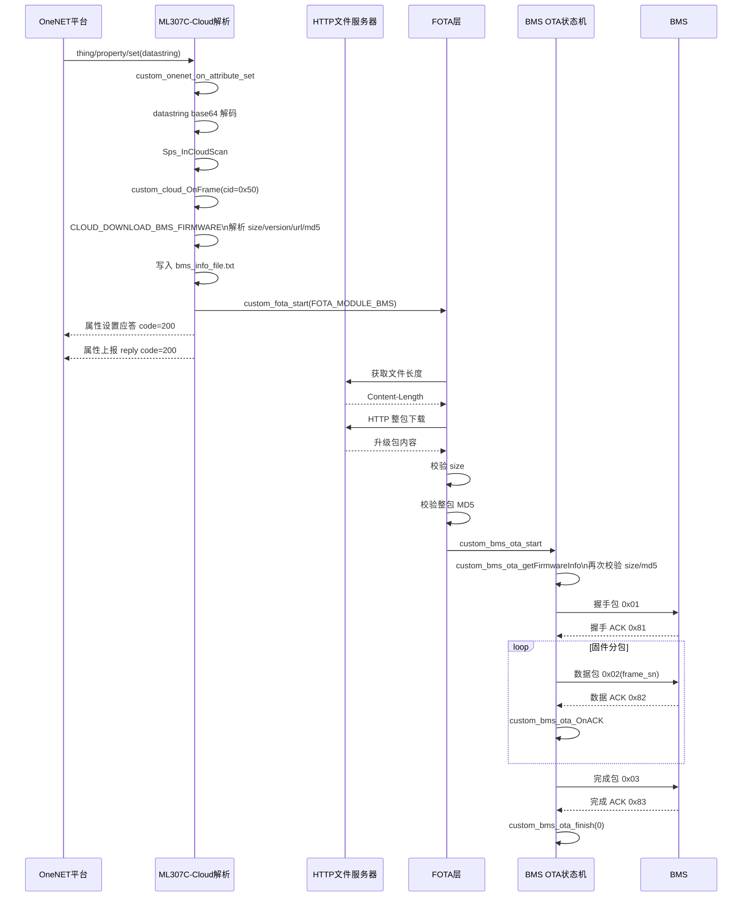

# BMS OTA 流程图

## Flowchart

```mermaid
flowchart TD
    A[OneNET 下发 thing/property/set] --> B[custom_onenet_on_attribute_set]
    B --> C[datastring base64 解码]
    C --> D[Sps_InCloudScan]
    D --> E[custom_cloud_OnFrame cid=0x50]
    E --> F[CLOUD_DOWNLOAD_BMS_FIRMWARE]
    F --> G[提取 size version url md5]
    G --> H[写入 bms_info_file.txt]
    H --> I[custom_fota_start FOTA_MODULE_BMS]
    I --> J[custom_fota_httpfile_download]
    J --> K{下载后 size 是否匹配}
    K -- 否 --> K1[终止 FOTA]
    K -- 是 --> L{整包 MD5 是否匹配}
    L -- 否 --> L1[终止 FOTA]
    L -- 是 --> M[FOTA_MODULE_BMS UPDATE-YES]
    M --> N[custom_bms_ota_start]
    N --> O[custom_bms_ota_getFirmwareInfo]
    O --> P{再次校验 size 与 MD5}
    P -- 否 --> P1[不进入 BMS OTA]
    P -- 是 --> Q[发送 Handshake 0x01]
    Q --> R[等待 Handshake ACK 0x81]
    R --> S[发送 Data 0x02]
    S --> T[等待 Data ACK 0x82]
    T --> U{是否还有下一包}
    U -- 是 --> S
    U -- 否 --> V[发送 Finish 0x03]
    V --> W[等待 Finish ACK 0x83]
    W --> X[custom_bms_ota_finish]
```

## SequenceDiagram

```mermaid
sequenceDiagram
    participant P as OneNET平台
    participant C as ML307C-Cloud解析
    participant H as HTTP文件服务器
    participant F as FOTA层
    participant S as BMS OTA状态机
    participant B as BMS

    P->>C: thing/property/set(datastring)
    C->>C: custom_onenet_on_attribute_set
    C->>C: datastring base64 解码
    C->>C: Sps_InCloudScan
    C->>C: custom_cloud_OnFrame(cid=0x50)
    C->>C: CLOUD_DOWNLOAD_BMS_FIRMWARE\n解析 size/version/url/md5
    C->>C: 写入 bms_info_file.txt
    C->>F: custom_fota_start(FOTA_MODULE_BMS)
    C-->>P: 属性设置应答 code=200
    C-->>P: 属性上报 reply code=200
    F->>H: 获取文件长度
    H-->>F: Content-Length
    F->>H: HTTP 整包下载
    H-->>F: 升级包内容
    F->>F: 校验 size
    F->>F: 校验整包 MD5
    F->>S: custom_bms_ota_start
    S->>S: custom_bms_ota_getFirmwareInfo\n再次校验 size/md5
    S->>B: 握手包 0x01
    B-->>S: 握手 ACK 0x81
    loop 固件分包
        S->>B: 数据包 0x02(frame_sn)
        B-->>S: 数据 ACK 0x82
        S->>S: custom_bms_ota_OnACK
    end
    S->>B: 完成包 0x03
    B-->>S: 完成 ACK 0x83
    S->>S: custom_bms_ota_finish(0)
```
