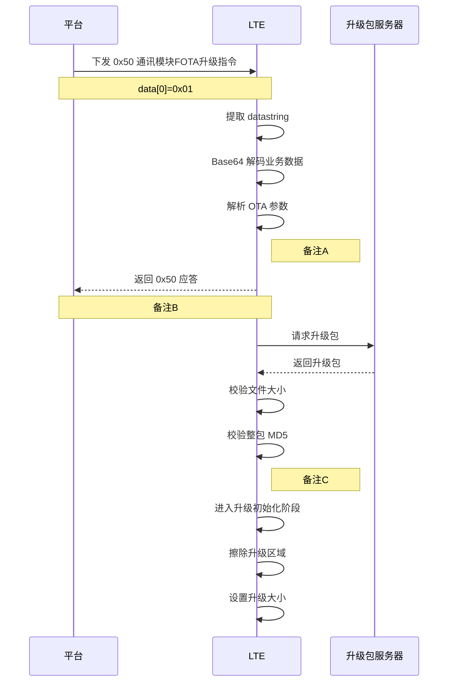

# LTE OTA 协议文档

## 主图

## 备注A

### 附录A-1 datastring 提取与解码判断

- 平台下发的业务数据中必须包含 `datastring`。
- `datastring` 必须能够成功完成 Base64 解码。
- 若 `datastring` 缺失或解码失败，则不进入 OTA 业务解析，平台侧返回本次属性处理失败。

### 附录A-2 协议帧合法性判断

- 帧头必须是 `0x7B`。
- 帧尾必须是 `0x7D`。
- 数据长度不能超出缓冲范围。
- XOR 校验必须正确。
- 任一条件不满足，则该业务帧无效，不进入后续 OTA 参数解析。

### 附录A-3 OTA 参数合法性判断

- 子命令必须是 `0x01`。
- 参数格式必须能够正确解析出 6 项。
- `size > 0`。
- `sw_ver / hw_ver / url / md5 / manufacturer` 均不能为空。
- `md5` 必须是 32 位十六进制字符串。
- `manufacturer` 必须符合约定值。
- 任一条件不满足，则本次升级指令前置校验失败，不进入 OTA 任务启动阶段。

## 备注B

### 附录B-1 0x50 应答结果说明

LTE 在完成升级指令接收、业务解析和前置校验后，向平台返回 0x50 应答。
字段“执行结果”用于表示该升级指令的处理结果。
执行结果 = 0x00 表示 LTE 已接收该升级指令，且前置处理通过，允许进入后续 OTA 任务阶段。
执行结果 ≠ 0x00 表示 LTE 在指令接收、业务解析、前置校验或 OTA 任务启动阶段未通过，本次升级指令不继续执行。
该应答仅表示升级指令的处理结果，不表示 OTA 已完成。
本节所述 0x50 应答属于业务应答，不等同于平台属性设置消息的通用应答。

## 备注C

### 附录C-1 启动 OTA 任务判断

- 升级地址不能为空。
- 预期文件大小必须大于 0。
- 预期 MD5 格式必须合法。
- 只有满足以上条件，才创建 OTA 任务并进入下载阶段。

### 附录C-2 下载阶段判断

- 必须能够成功获取升级包文件长度。
- 升级包采用内存方式保存。
- 可用堆空间必须满足下载和处理要求。
- HTTP 返回状态必须表示请求成功。
- 任一条件不满足，则下载阶段失败，不进入后续文件校验。

### 附录C-3 文件大小校验

- 下载完成后，实际文件大小必须与平台下发的预期大小一致。
- 若大小不一致，则本次升级终止，不进入 LTE 升级。

### 附录C-4 整包 MD5 校验

- 下载完成后，必须对完整升级包计算 MD5。
- 实际 MD5 必须与平台下发 MD5 一致。
- 若 MD5 不一致，则本次升级终止，不进入 LTE 升级。

### 附录C-5 刷写阶段判断

- 升级初始化必须成功。
- 擦除升级区域必须成功。
- 固件写入失败时允许重试一次，重试仍失败则终止。
- 升级触发必须成功。
- 升级触发成功后进入等待重启阶段。
