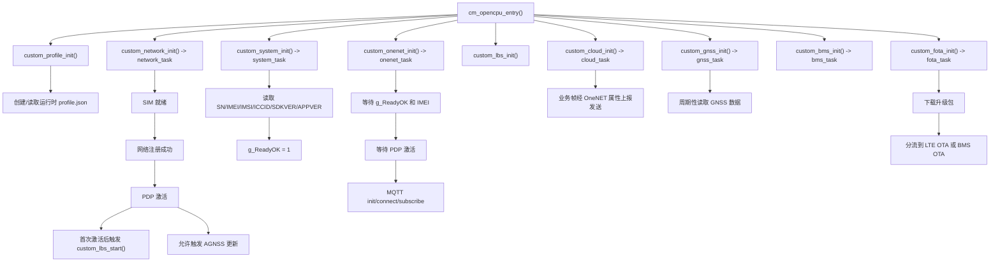

# `custom_main` 交接说明

## 适用范围

这份文档用于说明 `custom/custom_main` 这套主业务应用的整体结构，方便新接手的人快速建立正确的项目理解。

- 主入口：`custom/custom_main/src/custom_main.c`
- 目标：帮助接手人看清启动顺序、运行期职责、关键依赖关口和最快的排障入口
- 不在本文范围：`examples/` 和 `test/` 属于 SDK 示例或验证资产，不是当前主业务链路

## 核心理解模型

不要把这个项目当成“单个主循环”来看。

更准确的运行模型是：

- 一个启动装配函数
- 多个长期运行的工作线程
- 一组共享全局状态
- 轮询和等待式推进
- 失败后直接重启恢复

最关键的 4 个控制关口是：

1. `profile.json` 的创建与加载
2. 网络注册与 PDP 激活
3. 设备身份信息就绪
4. OneNET MQTT 连接生命周期

这 4 个关口中，只要有一个没打通，大部分上层业务都不会真正可用。

## 主入口流程

应用从 `custom/custom_main/src/custom_main.c` 里的 `cm_opencpu_entry()` 启动。

初始化顺序如下：

1. `custom_uart_init()`
2. `custom_usb_init()`
3. `custom_track_init()`
4. `custom_profile_init()`
5. `custom_lbs_init()`
6. `custom_network_init()`
7. `custom_watchdog_init()`
8. `custom_system_init()`
9. `custom_onenet_init()`
10. `custom_bms_init()`
11. `custom_led_init()`
12. `custom_gpio_init()`
13. `custom_bluetooth_init()`
14. `custom_test_init()`
15. `custom_cloud_init()`
16. `custom_gnss_init()`
17. `custom_bms_ota_init()`
18. `custom_cloud_lte_init()`
19. `custom_fota_init()`

这里要注意几点：

- `cm_opencpu_entry()` 是启动装配器，不是业务主循环
- 多数真实业务行为发生在各模块 `*_init()` 之后创建的线程里
- 启动是否成功，更多取决于线程里的副作用和状态推进，而不是 `cm_opencpu_entry()` 的返回值

## 运行期总流程图

## 各子系统职责与依赖

### 1. 配置与持久化

核心函数：

- `custom_profile_init()`
- `custom_profile_to_object()`
- `custom_profile_load()`
- `custom_profile_update()`
- `custom_object_create()`

主要行为：

- 检查 `PROFILE_NAME` 是否存在
- 若不存在则创建默认 JSON 配置
- 把运行时文件内容读入 cJSON 对象
- 当 `magical` 版本变化时执行配置迁移

接手时要关注：

- `profile.json` 是运行时生成文件，不在仓库中
- 这一步失败会影响后续所有读取配置的模块
- 里面保存了设备身份相关参数和 LBS PID 等关键值

最快排障入口：

- 先看 profile 创建、文件读取、参数加载日志，再看云、定位等上层问题

### 2. 网络关口

核心函数：

- `custom_network_task()`
- `custom_network_event_callback()`
- `custom_network_check_sim_ready()`
- `custom_network_check_register()`
- `custom_network_check_active()`

运行顺序：

1. 确保 `CFUN == 1`
2. 等待 SIM 就绪
3. 等待网络注册成功
4. 等待 PDP 激活
5. 进入每 60 秒一次的状态巡检循环

关键状态：

- `network_state.SimCard`
- `network_state.Register`
- `network_state.PDPActive`
- `network_state.CSQ`

重要行为：

- 遇到重复失败时不会降级处理，而是直接重启
- SIM、注册、PDP 失败累计到阈值后会走 `cm_pm_reboot()`
- 第一次 `NETWORK_EVENT_PDP_ACTIVED` 会触发 `custom_lbs_start(CM_LBS_PLAT_ONEOSPOS)`

这是项目的第一个硬关口。

### 3. 系统身份关口

核心函数：

- `custom_system_task()`
- `custom_system_info()`
- `custom_system_read_iccid_with_retry()`

主要行为：

- 填充 `g_SN`、`g_IMEI`、`g_IMSI`、`g_ICCID`、`g_SDKVER`、`g_APPVER`
- 设置 `g_ReadyOK = 1`
- 对 ICCID 做重试读取
- 当 profile 中 `device_id` 为空时，用 `g_IMEI` 回写

为什么重要：

- OneNET 任务在系统身份就绪前不会继续
- 如果 `IMEI` 或 `g_ReadyOK` 卡住，即使网络已经激活，云侧能力也不会真正工作

### 4. OneNET 传输关口

核心函数：

- `custom_onenet_task()`
- `custom_onenet_mqtt_wait_system_info_ready()`
- `custom_onenet_mqtt_wait_network_ready()`
- `custom_onenet_mqtt_client_init()`
- `custom_onenet_mqtt_connect_server()`
- `custom_onenet_mqtt_subscribe_topic()`
- `custom_onenet_mqtt_disconnect_server()`

运行顺序：

1. 等待 `g_ReadyOK` 和非空 `g_IMEI`
2. 等待 `custom_network_IsPDPActive()`
3. 构建 MQTT client 和 topic
4. 生成 token
5. 连接 OneNET
6. 订阅属性相关 topic
7. 持续在线直到连接断开

关键状态：

- `onenet_mqtt_conn_flag`
- `onenet_mqtt_sub_flag`
- `onenet_message_count`

重要行为：

- 多种等待超时最终都会走 `cm_pm_reboot()`
- 云侧 payload 和属性读写都经由这一层
- 即使上层模块名叫 `cloud`，底层真实公网传输通道仍然是 OneNET

这是网络激活后的第二个硬关口。

### 5. LBS 与 GNSS 定位层

LBS 侧核心函数：

- `custom_lbs_init()`
- `custom_lbs_start()`
- `custom_lbs_cb()`

GNSS 侧核心函数：

- `custom_gnss_task()`
- `custom_gnss_enable()`
- `custom_gnss_getlocateinfo()`

这里要明确：

- LBS 和 GNSS 是两套并行定位子系统
- LBS 依赖 PDP 真的可用，更偏向网络辅助定位
- GNSS 持续运行，在 PDP 激活后还能触发 AGNSS 更新

不要误判成：

- GNSS 正常就代表 LBS 正常
- LBS 出错就代表 GNSS 也坏了

### 6. Cloud、BMS 和 OTA

Cloud 侧核心函数：

- `custom_cloud_init()`
- `custom_cloud_sendFrame()`
- `custom_cloud_send_onenet_attribute_post()`

OTA 侧核心函数：

- `custom_fota_task()`
- `custom_fota_httpfile_download()`
- `custom_fota_lte_ota_start()`
- `custom_bms_ota_start()`

重要理解：

- `custom_cloud_sendFrame()` 负责封装业务协议帧，再通过 OneNET 属性上报通道发出去
- `custom_fota_task()` 轮询 `fota.state`，触发升级后先下载，再分流到 LTE OTA 或 BMS OTA

当前要谨慎看待的模块：

- `custom_bms_task()` 主循环很轻，接手时不要默认它已经承载完整主业务
- `custom_cloud_lte_task()` 当前基本只是 sleep 循环，也应视为预留或未完整展开的路径

## 接手优先级

### P0：先读这 4 个

- `custom/custom_main/src/custom_profile.c`
- `custom/custom_main/src/custom_network.c`
- `custom/custom_main/src/custom_system.c`
- `custom/custom_main/src/custom_onenet.c`

这 4 个文件构成了项目真正的启动骨架和故障闭环。

### P1：第二批再读

- `custom/custom_main/src/custom_lbs.c`
- `custom/custom_main/src/custom_gnss.c`
- `custom/custom_main/src/custom_cloud.c`
- `custom/custom_main/src/custom_fota.c`

这些文件提供业务能力，但都依赖 P0 关口已经打通。

### P2：谨慎看待

- `custom/custom_main/src/custom_bms.c`
- `custom/custom_main/src/custom_cloud_lte.c`
- `custom/custom_main/src/custom_test.c`

不要因为这些模块也在启动阶段被初始化，就默认它们是业务主骨架。

## 排障时必须先看的 4 个观察点

在钻进具体功能代码之前，先固定检查这 4 个点：

| 观察点 | 含义 | 主责任模块 |
| --- | --- | --- |
| `profile.json` 已创建并成功加载 | 运行时配置可用 | `custom_profile.c` |
| `network_state.PDPActive == 1` | 公网数据通道真实可用 | `custom_network.c` |
| `g_ReadyOK == 1` 且 `g_IMEI` 非空 | 设备身份信息已就绪 | `custom_system.c` |
| `onenet_mqtt_conn_flag == 1` | OneNET 传输通道在线 | `custom_onenet.c` |

这 4 个点里只要有一个没满足，就先不要急着查下游功能。

## 接手验证场景

### 冷启动

确认日志顺序是否符合控制链：

- `profile`
- `network`
- `system`
- `onenet`

如果日志看起来顺序错乱，先区分是线程调度带来的打印交错，还是实际依赖链真的有问题。

### 无 SIM 或未注册

确认：

- 重试阈值是否按预期生效
- 重启行为是否是设计本意
- 是否存在“看起来能恢复，实际上在反复重启”的假在线现象

### PDP 激活失败

确认：

- `NETWORK_EVENT_PDP_ACTIVE_FAIL` 的累计次数
- 最终重启路径是否按预期触发
- 是否在 PDP 真正激活前就开始查 LBS 或 AGNSS，导致排障方向偏掉

### 配置迁移

确认 `custom_profile_update()` 是否保留了这些关键值：

- `device_id`
- BMS 定时升级任务
- BMS 定时升级时间
- `lbs_oneos_pid`

### 云传输路径

确认 `custom_cloud_sendFrame()` 发出的业务帧，是否确实经由 OneNET 属性上报链路发送，而不是另有独立传输通道。

### 定位路径

要区分清楚：

- 真正发起 LBS 请求的调用，如 `cm_lbs_location()`
- 只是读取属性或打印调试信息的调用，如 `cm_lbs_get_attr()`

分析问题时不要把这两类调用混为一谈。

### 升级路径

确认：

- `fota.state` 是如何进入 `FOTA_STATE_UPGRADE`
- 升级包下载是否成功
- 后续是否分流到 LTE OTA 或 BMS OTA
- LTE OTA 启动后是否按设计走重启

## 推荐阅读顺序

对新接手的人，最短且最有效的阅读顺序建议如下：

1. `custom/custom_main/src/custom_main.c`
2. `custom/custom_main/src/custom_profile.c`
3. `custom/custom_main/src/custom_network.c`
4. `custom/custom_main/src/custom_system.c`
5. `custom/custom_main/src/custom_onenet.c`
6. `docs/codegraph-lbs-gnss-analysis.md`
7. `custom/custom_main/src/custom_lbs.c`
8. `custom/custom_main/src/custom_gnss.c`
9. `custom/custom_main/src/custom_cloud.c`
10. `custom/custom_main/src/custom_fota.c`

## 接手时的实用规则

- 先看状态关口，再看功能代码。
- 把重启当成控制流的一部分，不要当成偶发现象。
- “线程创建了”不等于“功能就绪了”。
- “网络注册成功”不等于 “PDP 已激活”。
- “OneNET 在线”不等于“业务协议健康”。
- “GNSS 有数据”不等于 “LBS 正常”。
