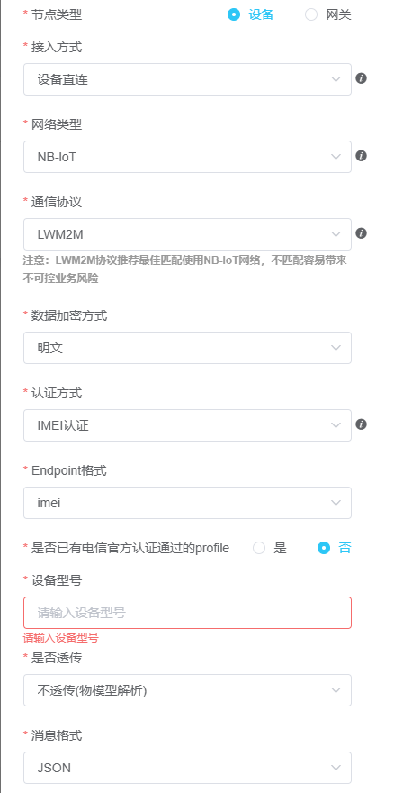
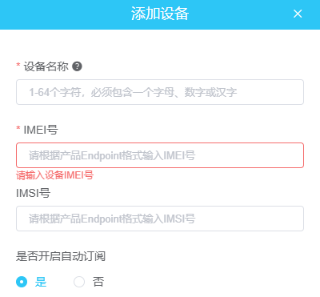
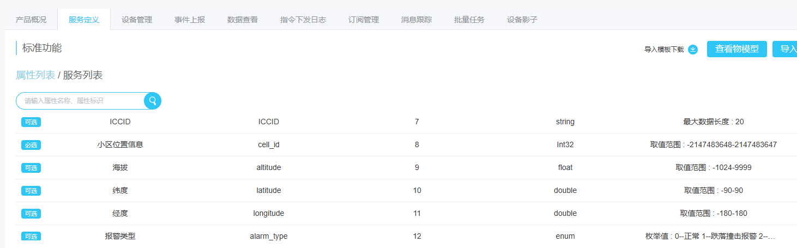
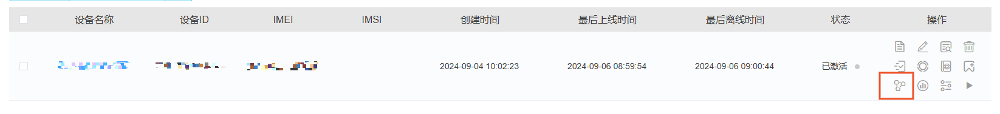

# LwM2M协议连接CTWing平台物模型并将获取到的定位数据通过JSON格式上报  

## **相关平台和协议介绍**
认识CTWing：CTWing是中国电信物联网开放平台，是中国电信新型数字基础设施能力底座。主要业务方向有电信物联网、电信物联网卡、电信5g定制网、电信NB-IOT等。同时CTWing还提供AIoT平台+应用服务，赋能数字化转型。

更多CTWing资料获取请访问CTWing门户网站 [CTWing门户网站](https://www.ctwing.cn/)

轻量级M2M传输协议，英文名称：Lightweight M2M（LwM2M）,由开发移动联盟（OMA）提出，是一种轻量级的、标准通用的物联网设备管理协议，可用于快速部署客户端/服务器模式的物联网业务。LwM2M为物联网设备的管理和应用建立了一套标准，它提供了轻便小巧的安全通信接口及高效的数据模型，以实现M2M设备管理和服务支持。

物模型指将物理空间中的实体数字化，并在云端构建该实体的数据模型。在物联网平台中，定义物模型即定义产品功能。完成功能定义后，系统将自动生成该产品的物模型。物模型描述产品是什么、能做什么、可以对外提供哪些服务。

## **实现功能**
实现模组使用LwM2M协议连接CTWing物模型，获取定位数据并上报，包括以下子功能：  
1. 添加资源并连接平台；  
2. 获取GNSS定位数据；  
4. 对定位数据进行JSON组包；  
5. 将JSON组包后的定位数据上报平台；  
6. 断开连接并释放资源 ；  

## **APP执行流程**
1. 设备上电，等待PDP激活；  
```
    int32_t pdp_time_out = 0;
    
    while(1)
    {
        if(pdp_time_out > 20)
        {
            cm_log_printf(0, "network timeout\n");
            cm_pm_reboot();
        }
        if(cm_modem_get_pdp_state(1) == 1)
        {
            cm_log_printf(0, "network ready\n");
            break;
        }
        osDelay(200);
        pdp_time_out++;
    }
```
2. 配置连接参数并创建设备；  
3. 添加资源并连接平台，cm_lwm2m_open是异步接口，需要等待回调函数上报连接结果；  
```
    uint8_t instances_19[1] = {1};
    ret = cm_lwm2m_add_obj(lwm2m_dev, 19, instances_19, 1, 0, 0);

    if (CM_LWM2M_SUCCESS != ret)
    {
        cm_log_printf(0, "[CTWing] cm_lwm2m_add_obj() obj 19 fail, ret is %d\n", ret);
        return;
    }

    int32_t resoures_19[1] = {0};
    ret = cm_lwm2m_discover(lwm2m_dev, 19, resoures_19, 1);

    if (CM_LWM2M_SUCCESS != ret)
    {
        cm_log_printf(0, "[CTWing] cm_lwm2m_discover() obj 19 fail, ret is %d\n", ret);
        return;
    }

    conn_flag = 0;
    ret = cm_lwm2m_open(lwm2m_dev, 30, 86400);

    if (CM_LWM2M_SUCCESS != ret)
    {
        cm_log_printf(0, "[CTWing] cm_lwm2m_open() fail, ret is %d\n", ret);
        return;
    }

    /* 等待ctwing连接成功 */
    while (!conn_flag)
    {
        osDelay(1);
    }
    if (conn_flag != 1)
    {
        cm_log_printf(0, "[CTWing] conn err\n");
        return;
    }
```
4. 获取定位数据，示例中使用模拟获取定位数据，可以使用带定位功能的模组或者外接定位模块来获取真实的定位数据；  
5. 对定位数据进行JSON组包；  
6. 上报数据，先使用cm_lwm2m_notify_packing组包在用cm_lwm2m_notify上报；  
```
    /* lwm2m组包 */
    ret = cm_lwm2m_notify_packing(lwm2m_dev, 19, 0, 0, 1, (char *)test_payload, strlen((const char *)test_payload), 1);

    if (CM_LWM2M_SUCCESS != ret)
    {
        cm_log_printf(0, "[CTWing] cm_lwm2m_notify_packing() fail, ret is %d\n", ret);
        return;
    }
    static int mid = 1;

    /* 上报数据给物模型 */
    ret = cm_lwm2m_notify(lwm2m_dev, mid++);

    if (CM_LWM2M_SUCCESS != ret)
    {
        cm_log_printf(0, "[CTWing] cm_lwm2m_notify() fail, ret is %d\n", ret);
        return;
    }
```
7. 关闭连接并释放；  

## **平台预操作**
1. 创建一个物模型产品，本示例需要上报定位数据，所以选择了带有定位数据的智能安全帽；  

2. 设置相应产品参数，IMEI认证，消息格式为JSON；  

3. 产品创建成功后创建设备，输入设备的IMEI号；

4. 产品界面服务定义中可以查看当前产品支持的物模型数据；  

5. 设备界面点击数据查看可以查看上报的数据；  


## **使用说明**
- 支持的模组（子）型号：ML307R-DC/ML307C-DC-CN
- 支持的SDK版本：ML307R OpenCPU SDK 2.0.0/ML307C OpenCPU SDK 1.0.0版本及其后续版本
- 是否需要外设支撑：不需要
- 使用注意事项：  
1、开发人员使用前需实现掌握CTWing基础概念及其网页侧操作，参见CTWing门户网站 [CTWing门户网站](https://www.ctwing.cn/)  
- APP使用前提：开发板、SIM卡（APP需要上网）、CTWing账号

## **版本更新说明**

### **1.0.1版本**
- 发布时间：2024/12/25 10:28
- 修改记录：
  1. 新增支持的模组（子）型号以及支持的SDK版本

### **1.0.0版本**
- 发布时间：2024/10/22 18:42
- 修改记录：
  1. 初版


--------------------------------------------------------------------------------