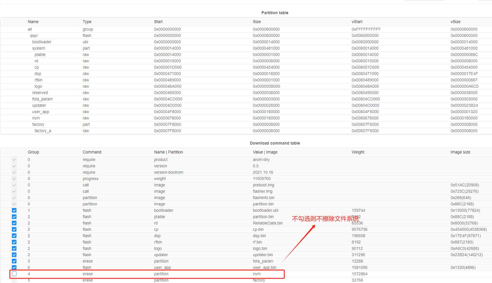

# 模组文件系统  

## **文件系统功能介绍**

文件系统为客户提供非易失数据存储功能，包括文件创建、打开、读取、写入、关闭、移动等操作。

## **实现功能**

实现对模组文件系统文件的创建、打开和读写：
1. 模组文件系统大小、文件大小的查询；
2. 从文件开始位置、当前位置、结束位置偏移地址读写数据；
3. 修改文件名、删除文件、判断文件是否存在。


## **APP执行流程**

1. 进入文件系统测试线程，获取并打印当前文件系统的总大小和剩余空间；

```c
    cm_fs_system_info_t fs_info = {0};
    cm_fs_getinfo(&fs_info);
    cm_log_printf(0,"[1]file system total:%d,remain:%d", fs_info.total_size, fs_info.free_size);
```

2.  获取并打印测试文件（文件名可自行修改宏定义）的大小（若首次运行，则文件不存在，cm_fs_filesize接口返回负数）；

```c
    cm_log_printf(0,"[2]<<%s>> file size is:%d", test_file1,cm_fs_filesize(test_file1));
```

3. 使用只写的方式创建一个文件（CM_FS_WB方式打开，若文件已存在，则已存在的文件内容将清空），并分两次写入数据后关闭文件；再使用只读方式打开文件，并读取和打印20字节文件内容，然后再关闭；最后打印目前测试文件的
大小；

```c
    int32_t fd = cm_fs_open(test_file1, CM_FS_WB);
    cm_fs_write(fd, "01234", 5);
    cm_fs_write(fd, "56789", 5);    
    cm_fs_close(fd);

    fd = cm_fs_open(test_file1, CM_FS_RB);
    int32_t f_len = cm_fs_read(fd, buf, 20);
    cm_log_printf(0,"[3]<<%s>> read len:%d, buf:%s\n", test_file1, f_len, buf);
    cm_fs_close(fd);

    cm_log_printf(0,"[3]<<%s>> file size is:%d", test_file1,cm_fs_filesize(test_file1));
```

4. 使用追写的方式打开或新建文件（CM_FS_AB方式不会将已存在的文件内容将清空），即偏移指针从文件内容尾部开始，写入新的数据后，使用只读方式读取内容；

```c
    fd = cm_fs_open(test_file1, CM_FS_AB);
    cm_fs_write(fd, "abcde", 5);    //在测试文件内容后追写5字节数据
    cm_fs_close(fd);
    fd = cm_fs_open(test_file1, CM_FS_RB);
    memset(buf,0,sizeof(buf));
    f_len = cm_fs_read(fd, buf, 20);
    cm_log_printf(0,"[4]<<%s>> read len:%d, buf:%s\n", test_file1, f_len, buf);
    cm_fs_close(fd);
```

5. 文件使用只读方式打开后，分别使用cm_fs_seek函数从文件开始位置偏移5字节、当前位置偏移5字节、文件尾部偏移0字节读取文件内容；

```c
    fd = cm_fs_open(test_file1, CM_FS_RB);
    memset(buf,0,sizeof(buf));
    cm_fs_seek(fd,5,CM_FS_SEEK_SET);    //从头部偏移5个字节读取
    f_len = cm_fs_read(fd, buf, 20);
    cm_log_printf(0,"[5.1]<<%s>> read len:%d, buf:%s\n", test_file1, f_len, buf);
    cm_fs_close(fd);

    /* 5.2 从当前位置开始偏移读  */    
    fd = cm_fs_open(test_file1, CM_FS_RB);
    memset(buf,0,sizeof(buf));
    cm_fs_seek(fd,5,CM_FS_SEEK_SET);    //先从头部偏移5个字节
    cm_fs_seek(fd,5,CM_FS_SEEK_CUR);    //再从当前位置偏移5个字节读取
    f_len = cm_fs_read(fd, buf, 20);
    cm_log_printf(0,"[5.2]<<%s>> read len:%d, buf:%s\n", test_file1, f_len, buf);

    /* 5.3 从尾部开始偏移读  */    
    fd = cm_fs_open(test_file1, CM_FS_RB);
    memset(buf,0,sizeof(buf));
    cm_fs_seek(fd,0,CM_FS_SEEK_END);    //从尾部偏移0个字节读取
    f_len = cm_fs_read(fd, buf, 20);
    cm_log_printf(0,"[5.3]<<%s>> read len:%d, buf:%s\n", test_file1, f_len, buf);
    cm_fs_close(fd);
```

6. 使用CM_FS_RBPLUS方式打开文件（可任意位置读写且不清空文件内容），从头部偏移5字节开始写数据并将最后读取文件内容打印；

```c
    fd = cm_fs_open(test_file1, CM_FS_RBPLUS);
    cm_fs_seek(fd,5,CM_FS_SEEK_SET);    //从头部偏移5个字节写
    cm_fs_write(fd, "abcde", 5);    //写5个字节
    cm_fs_close(fd);

    fd = cm_fs_open(test_file1, CM_FS_RB);
    memset(buf,0,sizeof(buf));
    f_len = cm_fs_read(fd, buf, 20);
    cm_log_printf(0,"[6]<<%s>> read len:%d, buf:%s\n", test_file1, f_len, buf);
    cm_fs_close(fd);
```

7. 将测试文件名修改为另一个文件名，并打印两个文件的存在状态和文件大小；

```c
    cm_fs_move(test_file1,test_file2);
    cm_log_printf(0,"[7]<<%s>> file exit state:%d,file size:%d\n", test_file1,cm_fs_exist(test_file1),cm_fs_filesize(test_file1));
    cm_log_printf(0,"[7]<<%s>> file exit state:%d,file size:%d\n", test_file2,cm_fs_exist(test_file2),cm_fs_filesize(test_file2));
```

8. 删除文件后，查询和打印文件存在的状态和文件大小；

```c
    cm_fs_delete(test_file2);
    cm_log_printf(0,"[8]<<%s>> file exit state:%d,file size:%d\n", test_file2,cm_fs_exist(test_file2),cm_fs_filesize(test_file2));
```

9. 再次查询文件系统总大小和剩余空间。

```c
    cm_fs_getinfo(&fs_info);
    cm_log_printf(0,"[9]file system total:%d,remain:%d", fs_info.total_size, fs_info.free_size);
```


## **使用说明**
- 支持的模组（子）型号：ML307R-DC
- 支持的SDK版本：ML307R OpenCPU SDK 2.0.0版本及其后续版本
- 是否需要外设支撑：无
- 使用注意事项：  
    1. 文件系统无路径/文件夹功能，勿在文件系统API入参中传入路径/文件夹信息；
    2. 不同的模组型号文件系统的大小可能不相同，注意查看剩余大小是否满足实际需求；
    3. 烧录固件默认选项会擦除文件系统的内容。

## **FAQ（非必要，视客户/FAE咨询情况增列）**

- 问题：烧录固件是否可不擦除文件系统的内容？
    回答：可以。不勾选"nvm"选项

- 问题：是否可以预置文件到文件系统中，即将文件预置到固件中，烧录该固件后模组文件系统中就有对应的文件？
    回答：可以。方法可参考《ML307x_文件系统镜像开发指导手册》。

## **版本更新说明**

### **1.0.0版本**
- 发布时间：2024/11/1 14:17
- 修改记录：
  1. 初版


--------------------------------------------------------------------------------