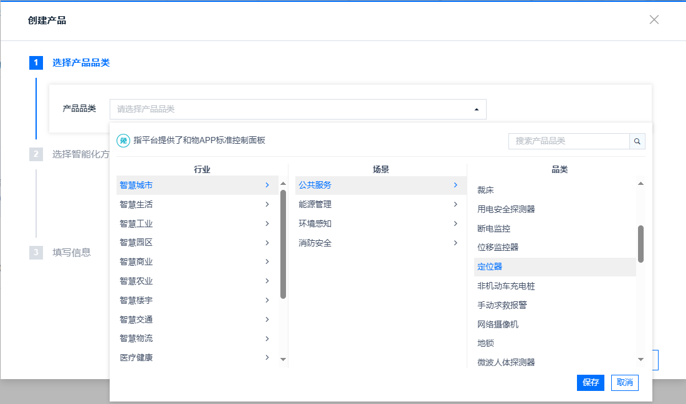
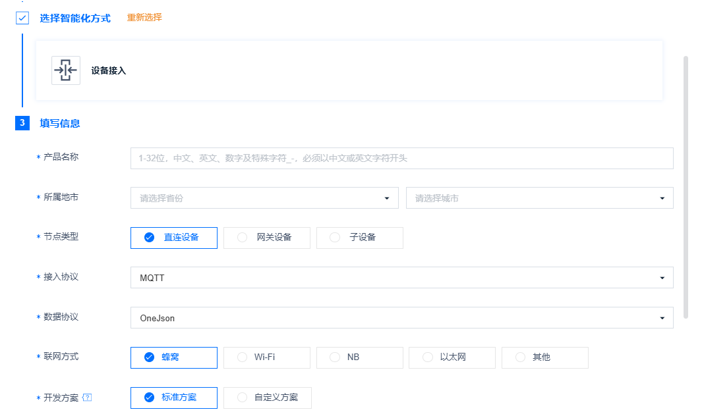
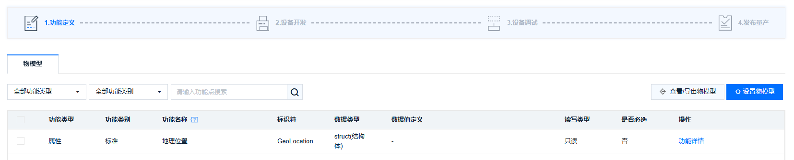
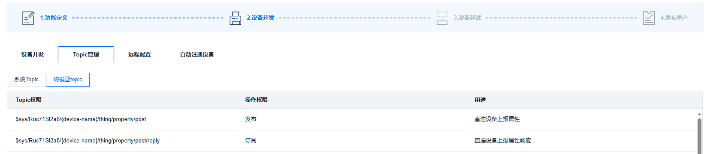

# MQTT协议连接OneNET平台物模型并将获取到的定位数据通过JSON格式上报  

## **相关平台和协议介绍**
认识OneNET：中国移动物联网开放平台是中移物联网有限公司基于物联网技术和产业特点打造的开放平台和生态环境，适配各种网络环境和协议类型，支持各类传感器和智能硬件的快速接入和大数据服务，提供丰富的API和应用模板以支持各类行业应用和智能硬件的开发，能够有效降低物联网应用开发和部署成本，满足物联网领域设备连接、协议适配、数据存储、数据安全、大数据分析等平台级服务需求。

更多OneNET资料获取请访问OneNET门户网站 [OneNET门户网站](https://open.iot.10086.cn/)

消息队列遥测传输协议，英文名称：Message Queuing Telemetry Transport（MQTT）是一个基于客户端-服务器的消息发布/订阅传输协议，工作在 TCP/IP协议之上。MQTT协议是轻量、简单、开放和易于实现的，这些特点使它适用范围非常广泛。

物模型指将物理空间中的实体数字化，并在云端构建该实体的数据模型。在物联网平台中，定义物模型即定义产品功能。完成功能定义后，系统将自动生成该产品的物模型。物模型描述产品是什么、能做什么、可以对外提供哪些服务。

## **实现功能**
实现模组使用MQTT协议连接OneNET物模型，获取定位数据并上报，包括以下子功能：  
1. 根据三元组计算token并连接上平台；  
2. 订阅topic；  
3. 获取GNSS定位数据；  
4. 对定位数据进行JSON组包；  
5. 将JSON组包后的定位数据上报平台；  
6. 断开连接并释放资源 ；  

## **APP执行流程**
1. 设备上电，等待PDP激活；  
```
    int32_t pdp_time_out = 0;
    
    while(1)
    {
        if(pdp_time_out > 20)
        {
            cm_log_printf(0, "network timeout\n");
            cm_pm_reboot();
        }
        if(cm_modem_get_pdp_state(1) == 1)
        {
            cm_log_printf(0, "network ready\n");
            break;
        }
        osDelay(200);
        pdp_time_out++;
    }
```
2. MQTT初始化；  
3. 计算token；  
4. 连接平台，cm_mqtt_client_connect是异步接口，需要等待回调函数返回连接结果；  
```
    conn_flag = 0;
    /* mqtt连接 */
    cm_mqtt_client_connect(_mqtt_client[0], &conn_options);//连接

    /* 等待mqtt连接成功 */
    while (!conn_flag)
    {
        osDelay(1);
    }
    if (conn_flag != 1)
    {
        cm_log_printf(0, "\r\n[MQTT]CM MQTT conn err\n");
        return;
    }
```
5. 订阅topic，cm_mqtt_client_subscribe是异步接口，需要等待回调函数返回订阅结果；  
```
    sub_flag = 0;
    
    /* 订阅mqtt topic   */
    int ret = cm_mqtt_client_subscribe(_mqtt_client[0], (const char**)topic_tmp, qos_tmp, 1);
    
    if (0 > ret)
    {
        cm_log_printf(0, "\r\n[MQTT]CM MQTT subscribe ERROR!!!, ret = %d\r\n", ret);
    }

    /* 等待mqtt订阅成功 */
    while (!sub_flag)
    {
        osDelay(1);
    }
```
6. 获取定位数据，示例中使用模拟获取定位数据，可以使用带定位功能的模组或者外接定位模块来获取真实的定位数据；  
7. 对定位数据进行JSON组包；  
8. 上报数据；  
9. 关闭连接并释放；  

## **平台预操作**
1. 创建一个物模型产品，本示例对应的产品是定位器；  

2. 选择设备接入后选择相应产品参数；  

3. 产品创建成功后创建设备；
4. 产品界面功能定义中可以查看当前产品支持的物模型数据；  

5. 产品界面设备开发中可以查看当前产品支持的topic；  

6. 设备管理界面可以看到设备名称、产品ID、设备密钥，作为三元组数据；

## **使用说明**
- 支持的模组（子）型号：ML307R-DC/ML307C-DC-CN
- 支持的SDK版本：ML307R OpenCPU SDK 2.0.0/ML307C OpenCPU SDK 1.0.0版本及其后续版本
- 是否需要外设支撑：不需要
- 使用注意事项：  
1、开发人员使用前需实现掌握OneNET基础概念及其网页侧操作，参见OneNET门户网站 [OneNET门户网站](https://open.iot.10086.cn/)  
- APP使用前提：开发板、SIM卡（APP需要上网）、OneNET账号

## **版本更新说明**

### **1.0.1版本**
- 发布时间：2024/12/24 10:26
- 修改记录：
  1. 新增支持的模组（子）型号以及支持的SDK版本

### **1.0.0版本**
- 发布时间：2024/10/22 18:42
- 修改记录：
  1. 初版

--------------------------------------------------------------------------------