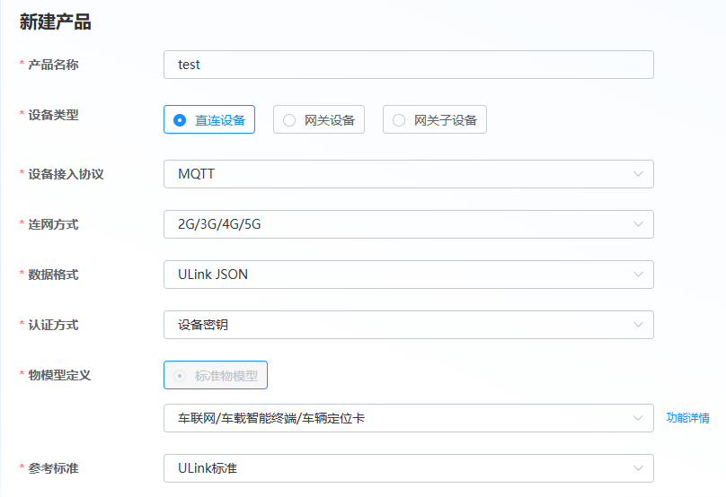
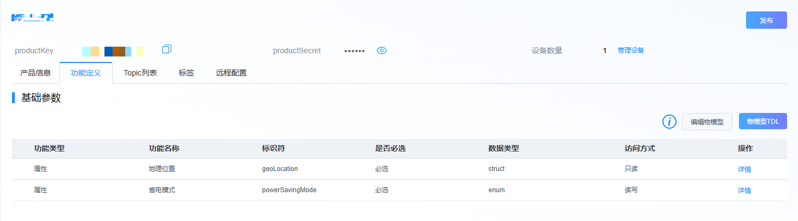
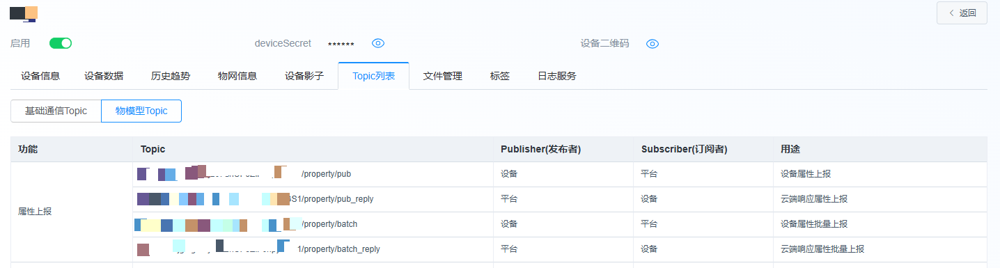
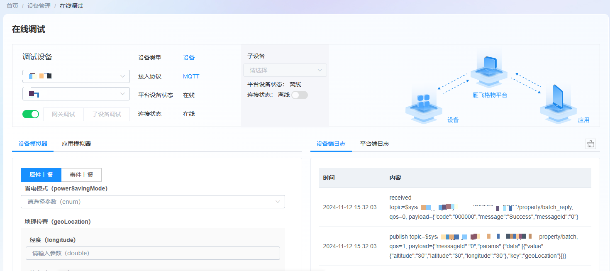

# MQTT协议连接Unicom雁飞格物平台物模型并将获取到的定位数据通过JSON格式上报  

## **相关平台和协议介绍**
认识Unicom雁飞格物平台：格物平台为设备提供安全可靠管理能力，是一个可以快速连接设备和企业系统的物联网平台。向下接入分散的物联网传感器，汇集传感数据；向上面向应用层服务提供应用开发的基础性平台和面向底层网络的统一数据接口。格物平台提供了如设备管理、规则引擎、物网管理等功能，平台具有高可靠性、高安全性、高并发、高开放性、低时延、强大的数据处理功能和可维护性强、易用性强等优势，可广泛应用于工业、运输、建筑、能源、智慧城市、医疗、安保、农业和零售等领域。

更多雁飞格物平台资料获取请访问雁飞格物平台门户网站： [雁飞格物平台门户网站](https://dmp.cuiot.cn/#/)

消息队列遥测传输协议，英文名称：Message Queuing Telemetry Transport（MQTT）是一个基于客户端-服务器的消息发布/订阅传输协议，工作在 TCP/IP协议之上。MQTT协议是轻量、简单、开放和易于实现的，这些特点使它适用范围非常广泛。

物模型指将物理空间中的实体数字化，并在云端构建该实体的数据模型。在物联网平台中，定义物模型即定义产品功能。完成功能定义后，系统将自动生成该产品的物模型。物模型描述产品是什么、能做什么、可以对外提供哪些服务。

## **实现功能**
实现模组使用MQTT协议连接Unicom雁飞格物平台物模型，获取定位数据并上报，包括以下子功能：  
1. 根据产品和设备参数计算token并连接上平台；  
2. 订阅topic；  
3. 获取GNSS定位数据；  
4. 对定位数据进行JSON组包；  
5. 将JSON组包后的定位数据上报平台；  
6. 断开连接并释放资源 ；  

## **APP执行流程**
1. 设备上电，等待PDP激活；  
```
    int32_t pdp_time_out = 0;
    
    while(1)
    {
        if(pdp_time_out > 20)
        {
            cm_log_printf(0, "network timeout\n");
            cm_pm_reboot();
        }
        if(cm_modem_get_pdp_state(1) == 1)
        {
            cm_log_printf(0, "network ready\n");
            break;
        }
        osDelay(200);
        pdp_time_out++;
    }
```
2. MQTT初始化；  
3. 计算token；  
token的计算说明和mqtt相关接入参数的说明可以查看平台设备接入指导部分：[雁飞格物平台设备接入](https://help-dmp.cuiot.cn/#/onlineDocument/display?articleId=68&articleTypeId=0)  
4. 连接平台，cm_mqtt_client_connect是异步接口，需要等待回调函数返回连接结果；  
```
    conn_flag = 0;
    /* mqtt连接 */
    cm_mqtt_client_connect(_mqtt_client[0], &conn_options);//连接

    /* 等待mqtt连接成功 */
    while (!conn_flag)
    {
        osDelay(1);
    }
    if (conn_flag != 1)
    {
        cm_log_printf(0, "\r\n[MQTT]CM MQTT conn err\n");
        return;
    }
```
5. 订阅topic，cm_mqtt_client_subscribe是异步接口，需要等待回调函数返回订阅结果；  
```
    sub_flag = 0;
    
    /* 订阅mqtt topic   */
    int ret = cm_mqtt_client_subscribe(_mqtt_client[0], (const char**)topic_tmp, qos_tmp, 1);
    
    if (0 > ret)
    {
        cm_log_printf(0, "\r\n[MQTT]CM MQTT subscribe ERROR!!!, ret = %d\r\n", ret);
    }

    /* 等待mqtt订阅成功 */
    while (!sub_flag)
    {
        osDelay(1);
    }
```
6. 获取定位数据，示例中使用模拟获取定位数据，可以使用带定位功能的模组或者外接定位模块来获取真实的定位数据；  
7. 对定位数据进行JSON组包；  
8. 上报数据；  
9. 关闭连接并释放；  

## **平台预操作**
1. 创建一个物模型产品，选择产品参数，本示例对应的物模型是车辆定位卡；  

2. 产品创建成功后创建设备；
3. 产品界面功能定义中可以查看当前产品支持的物模型数据；  

4. 设备界面的topic列表中可以查看当前设备支持的topic；  

5. 设备信息界面可以看到productKey、deviceKey、iotId、deviceSecret等接入参数，设备数据界面可以看到设备上报的数据；
6. 设备管理中的在线调试界面可以进行在线调试物模型，查看上报的数据格式；  
  
## **使用说明**
- 支持的模组（子）型号：ML307R-DC/ML307C-DC-CN/ML307C-DC-CN
- 支持的SDK版本：ML307R OpenCPU SDK 2.0.0/ML307C OpenCPU SDK 1.0.0版本及其后续版本
- 是否需要外设支撑：不需要
- 使用注意事项：  
1、开发人员使用前需实现掌握Unicom雁飞格物平台基础概念及其网页侧操作，参见Unicom雁飞格物平台门户网站 [Unicom雁飞格物平台门户网站](https://dmp.cuiot.cn/#/)  
2、使用示例前需要在源文件前半部分将产品和设备信息补充完整
- APP使用前提：开发板、SIM卡（APP需要上网）、Unicom雁飞格物平台账号

## **版本更新说明**

### **1.0.1版本**
- 发布时间：2024/12/24 11:32
- 修改记录：
  1. 新增支持的模组（子）型号以及支持的SDK版本

### **1.0.0版本**
- 发布时间：2024/10/22 18:42
- 修改记录：
  1. 初版


--------------------------------------------------------------------------------